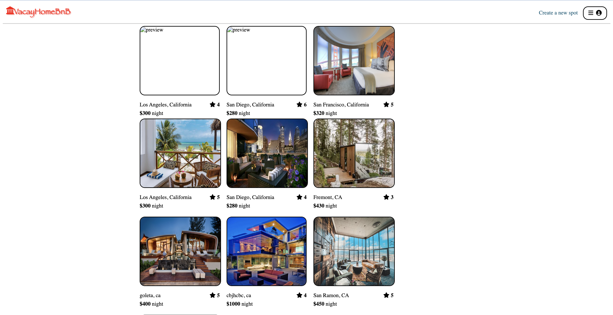

## AirBnB Clone

# VacayHomeBnB

## Table of Contents

- Link to Live Site
- Description
- Preview
- Getting Started
- Technologies
- Wireframes

<br>

## Link to Live Site

https://komal-auth-me.onrender.com

## Description

VacayHomeBnB is a clone site inspired by airbnb.
The Key features of the site:

- Login-SignUp
- Spot: Create/Manage/Update/Delete
- Review: Create/Update/Delete

<br>

## Getting Started

1. Clone this repository

   ```bash
   git clone https://github.com/komalaher18/VacayHomeBnB.git
   ```

2. Install dependencies

   ```bash
   npm install
   ```

3. Create a **.env** file based on the .env.example file with secret key of your choice. Recommendation to generate a strong secret: create a random string using `openssl` (a library that should already be installed in your Ubuntu/MacOS shell). Run `openssl rand -base64 10` to generate a random JWT secret.

4. Setup your Database by running the following command

   ```bash
   npm sequelize
   ```

5. Run backend

   ```bash
   npm start
   ```

6. To run the React App, go inside the `frontend` directory, `npm start`. This should open your browser automatically but if not, you may navigate to `localhost:8000` to access the application.

<br>
<br>

## Technologies:

<br>
<p float="left">
  
  &nbsp;
  
  &nbsp;
  
  &nbsp;
  
  &nbsp;
  
  &nbsp;
  
  &nbsp;
</p>

<br>

## Wireframes

- [Screen Blueprint] (https://appacademy-open-assets.s3.us-west-1.amazonaws.com/Modular-Curriculum/content/week-16/AirBnB+MVP+Wireframes.pdf)

<br>

## Screenshots




